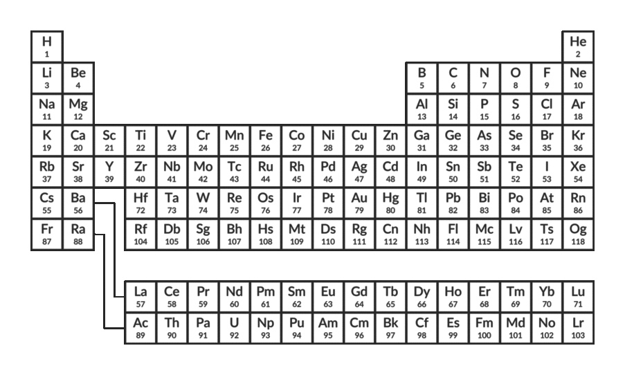
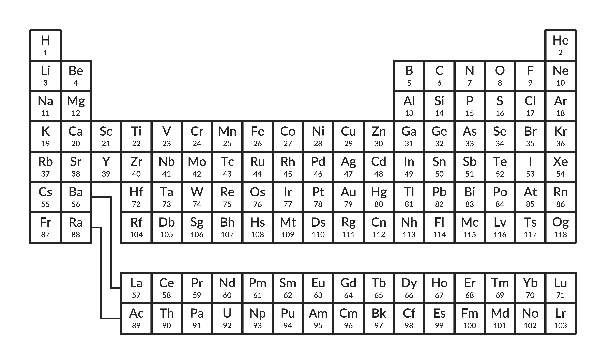
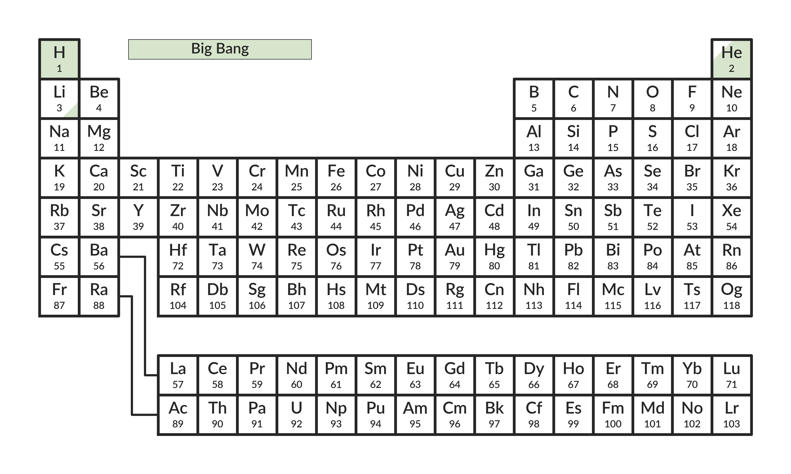
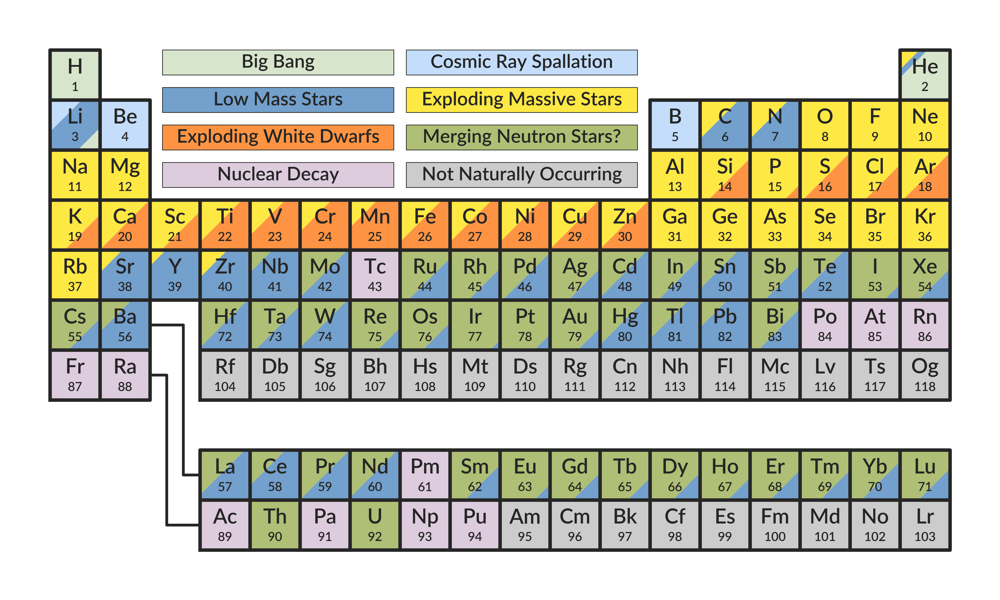
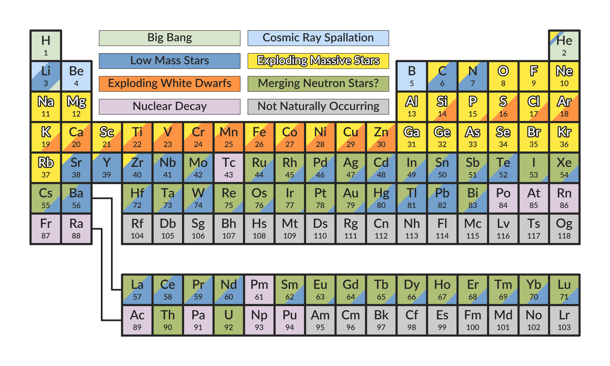
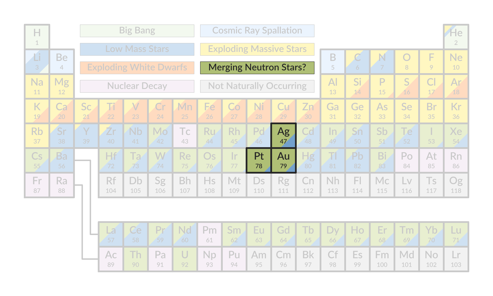
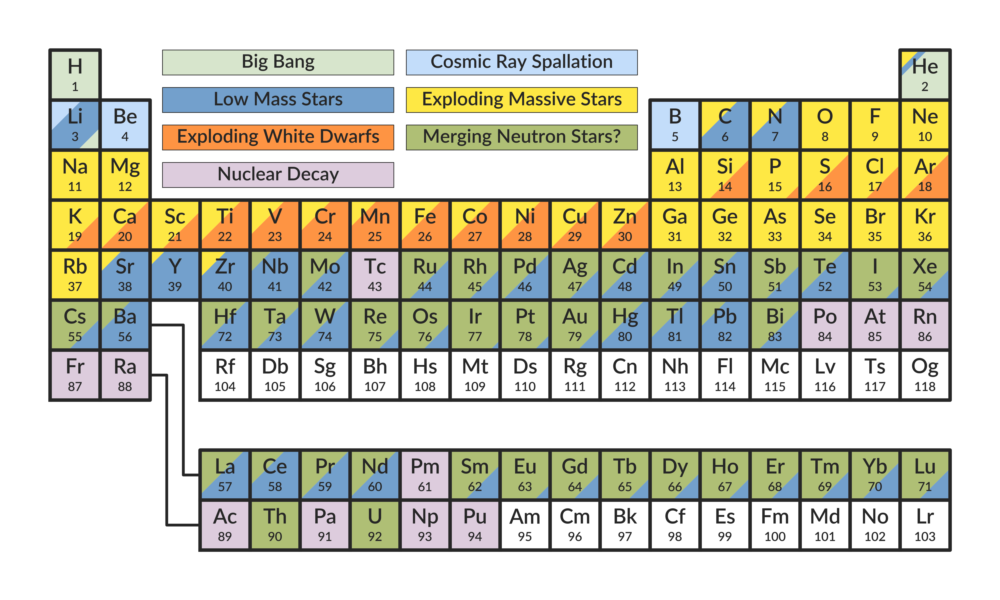
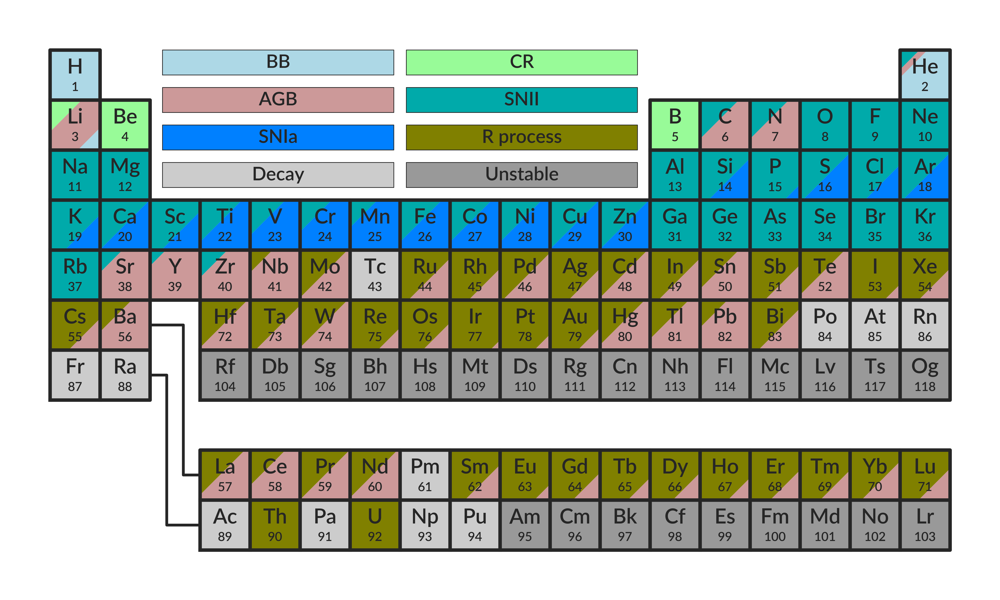

# periodic_table



This is a library to make figures showing the sources of different elements on the periodic table. It can also highlight desired sources and isolate different elements.

## Installation

TBD

## Using `periodic_table`

To make the table, simply import it and initialize the `PeriodicTable` class.

```python
import periodic_table
table = periodic_table.PeriodicTable()
```

This results in an empty table.



Single sources can be shown on the table.

```python
table.show_source("bb")
```



Or all can be added at once.

```python
table.show_all_sources()
```



Individual sources can be highlighted. This highlights all elements that have more than 50% from the listed source.


```python
table.highlight_source("SNII")
```



This highlighting can be removed.

```python
table.unhighlight_all_sources()
```


Indidual elements can also be isolated to bring even more attention to them.

```python
table.isolate_elt("Au", "Ag", "Pt")
```



This isolation can also be removed.

```python
table.unisolate_all_elts()
```


If you want to modify the plot by removing certain sources, that can be done too.

```python
table.unshow_source("unstable")
```



The highlighting and isolation can be used with any set of shown sources (although to highlight a source that source does need to be present).

Lastly, the colors and names of the sources have default values, but can be modified by passing in values to the constructor.

```python
table = periodic_table.PeriodicTable(label_bb="BB", 
                                     label_cr="CR", 
                                     label_agb="AGB", 
                                     label_snii="SNII",
                                     label_snia="SNIa", 
                                     label_r="R process", 
                                     label_decay="Decay", 
                                     label_unstable="Unstable",
                                     color_bb="lightblue",
                                     color_cr="palegreen",
                                     color_agb="#CC9999",
                                     color_snii="#00AAAA",
                                     color_snia=(0, 0.5, 1.0),
                                     color_r=(0.5, 0.5, 0),
                                     color_decay="0.8",
                                     color_unstable="0.6")
table.show_all_sources()
```


Use the `table.save()` method to save the figure at any point.

Note that if you're doing this in a Jupyter notebook, use the `table.get_figure()` method to show the figure in the notebook. 
